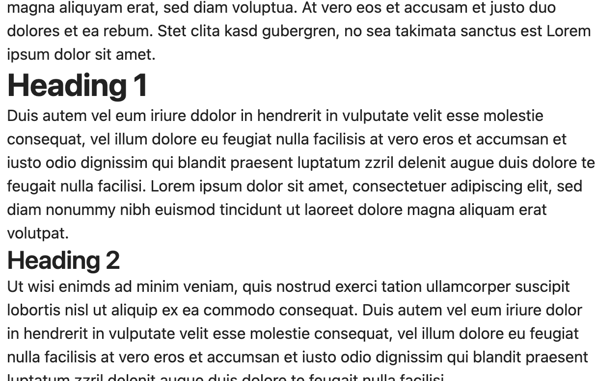
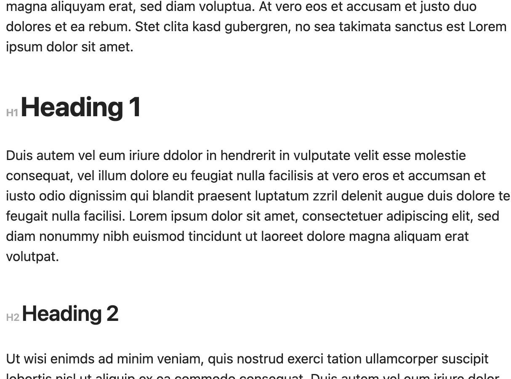

# obsidian-snippets

This repo contains css-snippets I use to make my obsidian a little bit prettier


**Header-Margins** increases the spacing above and below headings to make them more distinguishable from the rest of the text.

**Header-Indicators** adds indicators so that the headings can be better distinguished from each other.

**Color-Title** sets the color of the notes title to the current accent color

Before:

<p align="center">

</p>
  
After:

<p align="center">

</p>
  
## How to install:

Download the CSS-Files and copy them to the snippets directory inside your vault.
You can find this folder by opening Obsidian and navigating to 
`Settings -> Appearance -> CSS-snippets -> 📁 [Open snippets folder]`

After that, your Vault should look like this
```
[YOUR VAULT]/.obsidian/snippets/
  header-indicators.css
  header-margins.css
```
After copying the files you should activate the snippets in the appearance settings.

## Known Bugs

- The indicators are also displayed in front of formatting, so `# Heading with *Formatting*` gets displayed as "`H1` Heading with `H1` *Formatting*"

Special thanks to ChatGPT
